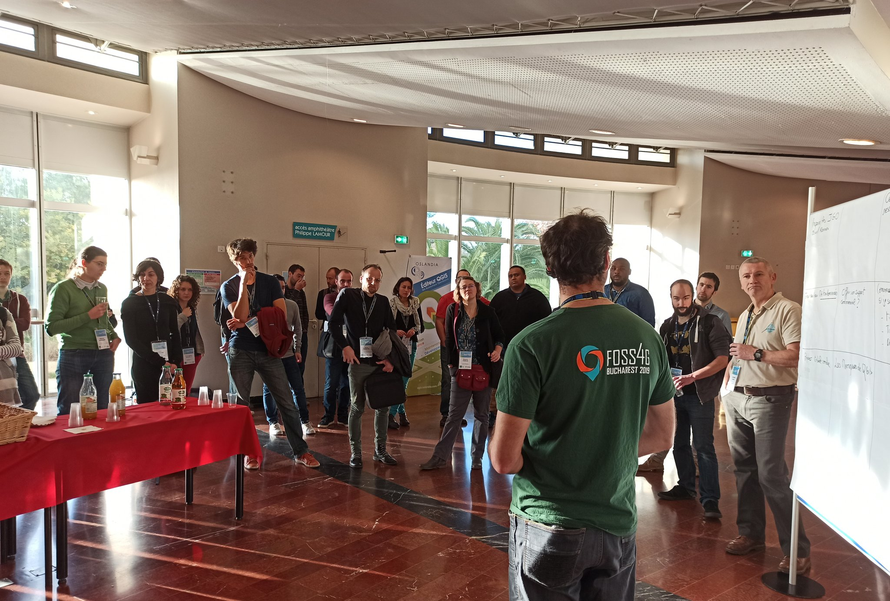

# Journées QGIS utilisateur - 1ère journée Barcamp

*Accueil de la journée*

Ce premier jour a été l'occasion de réaliser 3 sessions d'ateliers, afin que chacun puisse faire un retour sur sa pratique de QGIS et de faire le point sur l'actualité de QGIS. Malgré les perturbations dans les transports, la journée a tout de même réuni une cinquantaine de personnes !

Voici le résumé des sujets qui ont été abordés lors des différentes sessions

### 1ère session d'atelier du barcamp :
- création de plugin
- réunir la documentation QGIS
- point dataviz dans QGIS
- détection par imagerie
- appli pour matériel mobile
- point qgis serveur

*Restitution pour la première session d'atelier*

### 2ème session d'atelier :
- gestion des étiquettes
- QGIS 3D
- données OSM
- comment contribuer quand je suis pas dev
- mobilité, comment faire le lien à QGIS ?

*Restitution pour la deuxième session d'atelier*

### 3ème session d'atelier :
- introduction à l'utilisation de Github pour contribuer
- gestion avancée symbologie
- quelle offre de support pour QGIS ?
- comment contribuer lorsque je suis "un peu" dev

*Restitution pour la troisième session d'atelier*
